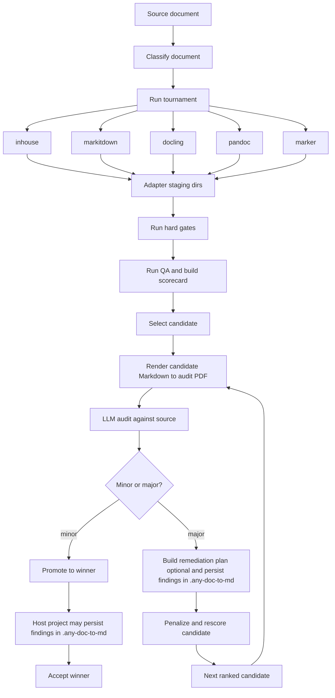

# any-doc-to-md

`anydoc2md` is a document-to-Markdown converter.

More precisely: it is a converter that stands on the shoulders of the best
existing conversion tools, runs them as competing candidates, asks an LLM to
help choose and validate the strongest output, and records what it learns so
future conversions can become better and faster.

It is not anti-converter. It is pro-converter, plural.

The bet is simple: no single backend wins every document. Real documents are
too varied. So `anydoc2md` treats conversion as a tournament:

- run multiple conversion methods
- normalize their outputs
- score structural quality
- audit the leading candidate against the source
- promote one winner
- persist findings that can drive remediation, overrides, and faster future
  decisions

That sounds simple. It is not.

Document conversion is one of those engineering problems that looks solved
until a real document arrives:

- the PDF with the figure caption attached to the wrong image
- the DOCX whose numbering restarts in the middle
- the HTML export that turns a table into decorative whitespace
- the scanned report where the converter is technically "successful" and
  practically unusable

`anydoc2md` exists because "pick one converter and hope" is not a strategy,
but neither is rebuilding the whole conversion universe from scratch. The
better move is to orchestrate strong tools, judge them rigorously, and learn
from their failures.

What the package does:

- document-to-Markdown conversion across multiple adapters
- structural and fidelity QA over conversion outputs
- tournament-style ranking and winner selection
- LLM-assisted source-fidelity auditing of selected candidates
- project-local memory for findings, overrides, and deterministic scaffolds

What makes it interesting:

- It treats conversion as an evaluation problem, not just a parsing problem.
- It uses existing converter ecosystems instead of pretending they do not
  exist.
- It preserves evidence, not just outputs.
- It gives host applications one stable winner layout even when the upstream
  tools behave very differently.
- It uses LLM review as bounded source-fidelity validation, not as magic dust.
- It is opinionated in a useful way: converters compete, artifacts are
  normalized, and failures become actionable.

Source lives under `src/anydoc2md/`.

The canonical any-doc-to-md (ADTM) specification lives at
[`docs/specs/multi-method-converter-tournament.md`](docs/specs/multi-method-converter-tournament.md).
Parent projects should reference that package-owned spec instead of maintaining
their own copies.

If you work on ingestion, enterprise search, knowledge-base pipelines,
compliance archives, or AI/RAG systems, this package is worth understanding
because it encodes a hard-earned lesson:

> the best Markdown output is usually discovered, not assumed.

## Quick Start

Install (editable):

```bash
cd packages/any-doc-to-md
python -m pip install -e .
```

### CLI (host-provided)

`anydoc2md` is a library. Host applications usually provide the user-facing CLI
and call into the shared tournament/runtime surfaces.

In other words:

- package responsibility: convert, score, audit, normalize, persist findings
- host responsibility: environment loading, CLI UX, orchestration, exit behavior

In PRAI (this monorepo), you can run the KB-pack pipeline CLI in tournament mode:

```bash
cd backend
export ANYDOC2MD_JUDGE_URL="http://127.0.0.1:1234/v1"
export ANYDOC2MD_JUDGE_MODEL="qwen/qwen3.6-35b-a3b"
export ANYDOC2MD_JUDGE_TIMEOUT_S="360"

PYTHONPATH=. python -m source_ingestion.kb_pack_pipeline.cli --tournament --audit-mode auto \
  --adtm-dir ../.any-doc-to-md --write-scaffolds path/to/doc.pdf
```

To batch-convert the `tmp/tournament-test/sources` corpus:

```bash
cd backend
PYTHONPATH=. python scripts/convert_tournament_test_sources.py
```

To probe a local judge endpoint and find the smallest/fastest model that can
reliably surface audit issues, use the committed fixture PDFs that ship with
the package. The probe is a 10-page, text-heavy calibration packet with broken
headings, double/dot bullets, reordered numbered lists, empty box headings,
flattened tables, missing text, broken image references, and a figure moved away
from its caption. The screening prompt asks the model to fill a fixed boolean
checklist, so scoring is deterministic rather than judged by another model. By
default each selected model must pass that gate 10 times:

```bash
cd packages/any-doc-to-md
python -m anydoc2md.find_judge \
  --judge-url http://127.0.0.1:1234/v1 \
  --repeats 10 \
  --pass-threshold 0.6 \
  --timeout-s 30 \
  --show-all
```

For a focused run against one model:

```bash
python -m anydoc2md.find_judge \
  --judge-url http://127.0.0.1:1234/v1 \
  --model-name qwen/qwen3.6-35b-a3b \
  --repeats 10 \
  --pass-threshold 0.6 \
  --timeout-s 30 \
  --show-all
```

The first repeat is reported as `load+answer`, which captures model-switch or
on-demand load time when the endpoint loads models lazily. Later repeats are
used to estimate steady answer time. The live progress output includes elapsed
time and ETA because this benchmark is usually a one-time hardware calibration,
not something you want to babysit blindly.

When `--repeats 1`, the probe can only report `load+answer`. Separate load and
steady-answer timing become available when `--repeats >= 2`.

The pass policy is intentionally strict: one failed repeat disqualifies the
model. `find_judge` therefore stops testing that model on the first fail by
default and continues with the next model. Passing models print a model-level
conclusion after completing all required repeats. Use `--no-stop-on-fail` only
when you want the full repeat history for diagnostics.

Failure reasons are hidden by default to keep long calibration runs readable.
Use `--show-errors` when you want diagnostic details such as JSON parse errors
or checklist misses.

The pass gate is configurable with `--pass-threshold`. The default is `0.6`,
which means the model must mark at least 8 of 13 expected checklist issues and
must not trigger negative controls such as OCR gibberish or wrong-language
translation.

`--timeout-s` is the production usefulness threshold for steady answer time. It
does not replace `--judge-timeout-s`, which is the HTTP read timeout. A model can
take a while to load and still be useful; a model that repeatedly takes more
than `--timeout-s` to answer after loading is excluded from the passing list.

### Python

```python
from pathlib import Path

from anydoc2md.format_converters.tournament.orchestrator import run_full_tournament
from anydoc2md.settings import AUDIT_MODE_AUTO, JudgeSettings

result = run_full_tournament(
    source_path=Path("doc.pdf"),
    staging_root=Path("staging/doc.pdf"),
    audit_mode=AUDIT_MODE_AUTO,
    judge_settings=JudgeSettings(
        url="http://127.0.0.1:1234/v1",
        model="qwen/qwen3.6-35b-a3b",
        timeout_s=360,
    ),
)
print(result.winner, result.winner_staging_dir)
```

## Why ADTM Exists

Most conversion stacks are optimized for one of two stories:

1. "Works great on the demo file."
2. "Supports many formats."

Production systems need a third story:

3. "When the file is ugly, we still know why we trusted the output."

ADTM, short for *Any-Doc-to-Markdown Tournament*, is the package's answer to
that requirement.

The core move is deceptively strong:

- run more than one converter
- normalize the outputs into one comparable layout
- score them programmatically
- audit the leading candidate against the source
- keep the evidence and the failure reasons

This changes the operational posture of document conversion.

Instead of asking:

- "Which converter should we bless forever?"

you get to ask:

- "Which candidate won for this document, and what evidence supports that?"

That is a better question. It is more debuggable, more reviewable, and more
useful in front of users, teammates, and future-you.

## What You Learn By Reading This Package

Even if you never adopt the package whole, the design is useful:

- Normalize competing tools into one artifact contract.
- Separate *selection* from *execution*.
- Keep source-side evidence near quality decisions.
- Make LLM judgment auditable and bounded instead of mystical.
- Treat remediation output as reviewable scaffolding, not autonomous mutation.

That combination is what makes `anydoc2md` more interesting than "yet another
Markdown converter". It is a small systems design lesson wearing a practical
Python package as a disguise.

## How It Works

`anydoc2md` owns the reusable conversion tournament itself. A typical run goes
through these stages:

1. Classify the source document to capture rough structural traits.
2. Run the requested adapters into method-scoped staging directories.
3. Hard-disqualify obviously broken outputs.
4. Run programmatic QA on surviving candidates and rank them by weighted score.
5. Select the current leading candidate.
6. Build a source evidence packet from the source document, sampling across
   the document so larger files retain first, middle, and end coverage.
7. Render the candidate Markdown to an audit PDF.
8. Audit that candidate against the source via an LLM, using the source
   evidence packet, the rendered candidate PDF, and the candidate Markdown as
   supporting detail.
9. If the LLM finds major issues, optionally build a remediation plan, persist
   findings in `.any-doc-to-md/`, penalize and rescore the candidate, and
   retry with the next ranked candidate only if the rescored candidate is no
   longer leading.
10. If the candidate passes the audit, promote it to `winner/`, optionally
    persist host-project findings, and accept the winner.

The high-level idea is:

- conversion produces candidates
- QA produces comparable signals
- the judge produces source-aware criticism
- the runtime promotes one winner with a stable shape

That stable shape matters more than it first appears. It is what lets later
pipeline stages stop caring whether the winner came from `docling`,
`markitdown`, `pandoc`, `marker`, or the in-house converter.

The package owns the reusable tournament logic. Host projects may optionally
persist findings and feed project-local in-house overrides back into later runs
via a local `.any-doc-to-md/` directory.

When persisting project-local findings, hosts may also persist a richer source
evidence packet under `.any-doc-to-md/evidence-packets/` so escalations and
coding-agent follow-up can reference broader evidence than the in-prompt sample.



The diagram above describes the intended ADTM end-state. The current code
already has the post-selection audit loop, rendered candidate PDF generation,
winner promotion, remediation-plan persistence, project-local findings flow,
and both a bounded in-prompt source evidence packet and an optional persisted
evidence packet for offline review.

Per-adapter staging layout:

- `index.md`
- `images/`
- `adapter_result.json`

Promoted winner layout:

- `winner/index.md`
- `winner/images/`
- `winner/qa_report.json`
- `winner/remediation_plan.json` when judge findings produced one

That normalized layout is what lets the tournament compare different
converters uniformly and lets host projects ingest one stable winner path.

Audit artifacts currently added by the loop:

- source evidence packet embedded into the audit prompt
- `audit_candidate.pdf` inside the selected candidate staging dir
- `winner/qa_report.json`
- `winner/remediation_plan.json` when judge findings produced one

## Scope

This package owns reusable conversion and judging logic.

This package does not own:

- application-specific `.env` loading
- process exit behavior
- project-specific orchestration outside the shared conversion/judge surfaces

Host applications are expected to provide runtime configuration through environment variables or explicit `JudgeSettings`.

## Converter Methods

Current tournament adapters:

- `inhouse`
- `markitdown`
- `docling`
- `pandoc`
- `marker`

Adapter selection policy:

- default behavior: run all implemented adapters
- explicit adapter list: run exactly the adapters requested by the host project or user
- adapter failures such as missing CLIs are treated as candidate-level failures, not fatal tournament errors

External tools used:

| Adapter | External package / tool | Interface used | Typical input support |
|---|---|---|---|
| `inhouse` | none beyond Python libraries used internally | direct Python call | PDF, DOCX, HTML, TXT |
| `markitdown` | `markitdown` CLI | subprocess | PDF, DOCX, PPTX, XLSX, HTML, TXT, EPUB, ZIP |
| `docling` | `docling` CLI | subprocess | PDF, DOCX, PPTX, XLSX, HTML, Markdown, AsciiDoc, TXT |
| `pandoc` | `pandoc` CLI | subprocess | HTML, DOCX, Markdown, TXT, RST, AsciiDoc |
| `marker` | `marker_single` CLI | subprocess | PDF |

### In-house vs External Adapters

The in-house adapter is not just a fallback. It is a first-class tournament
candidate that uses the package's own converter modules directly.

All adapters are normalized into the same staging layout (`index.md`, `images/`,
and `adapter_result.json`) so the tournament can score and audit them uniformly.
The main differences are the conversion engine, image extraction behavior, and
dependency footprint.

| Dimension | `inhouse` | `markitdown` | `docling` | `pandoc` | `marker` |
|---|---|---|---|---|---|
| Execution model | direct Python modules | external CLI via subprocess | external CLI via subprocess | external CLI via subprocess | external CLI via subprocess |
| Normal output shape | already aimed at package staging layout | flat Markdown output, adapter writes `index.md` | `<stem>.md` + artifacts dir, adapter normalizes to `index.md` + `images/` | adapter writes `index.md` | marker output normalized into `index.md` + `images/` |
| Image handling | package-native staging + image-dimension annotation when images are present | typically no extracted image files; `images/` often empty | exports referenced image files and adapter rewrites them into `images/` | does not extract images; creates `images/` but leaves it empty | extracts images for PDFs and rewrites paths into `images/` |
| Dependency surface | only the package + Python libs | requires installed `markitdown` CLI | requires installed `docling` CLI | requires installed `pandoc` CLI | requires installed `marker_single` CLI |
| Failure mode | Python exception becomes structured adapter error | subprocess exit code / timeout / missing CLI | subprocess exit code / timeout / missing CLI | subprocess exit code / timeout / missing CLI | subprocess exit code / timeout / missing CLI |
| Main strength | tight integration and predictable staging semantics | broad input support and simple CLI contract | strong document-structure and image-export behavior | deterministic normalizer for text-centric formats | strong layout retention for PDFs |

Note: `pandoc` and `marker` are GPL-licensed external tools. Review their terms
before enabling them in commercial or redistributable pipelines.

### What "In-house" Means

`inhouse` wraps the package's own converter stack:

- `format_converters/pdf_converter.py`
- `format_converters/docx_converter.py`
- `format_converters/html_converter.py`
- `format_converters/txt_converter.py`

It differs from the external adapters in two important ways:

1. It does not shell out to an external converter binary.
2. It uses the package's own conversion logic directly, so layout decisions,
   normalization behavior, and staging semantics stay under package control.

The external adapters are useful as competing opinions in the tournament.
The in-house path is useful as the package-controlled baseline.

`pandoc` and `marker` are implemented adapters, not second-class placeholders.
By design, the default tournament policy should run all implemented adapters.
Hosts that want tighter control should pass an explicit adapter list instead of
relying on a partial default set.

## Project-local ADTM state

Host projects can optionally keep project-specific tournament state under a
local `.any-doc-to-md/` directory.

Supported patterns today:

- `llm-findings/<doc-key>.json` for persisted judge findings and remediation
  plans generated from tournament runs
- `evidence-packets/<doc-key>.json` for richer persisted source evidence packets
  referenced from `llm-findings` records
- `inhouse-overrides/<doc-key>.override.yaml` for coding-agent-authored
  in-house conversion overrides that get staged into `document.override.yaml`
  before the in-house converter runs
- `qa-extensions/<doc-key>.py` for project-local QA hook modules that can add
  checks or disable selected built-in checks for that document
- `inhouse-extensions/<doc-key>.py` for project-local in-house post-processing
  hooks that can patch the converted staging output for that document

Deterministic scaffold authoring is also available through
`anydoc2md.remediation_authoring.author_project_local_scaffolds(...)`. It
turns a persisted remediation plan into reviewable `qa-extensions/*.py` and
`inhouse-extensions/*.py` stubs without overwriting existing files by default.

This keeps parent-project-specific ADTM learnings out of package source while
still making them easy to review or share.

### Coding-agent operating modes

Recommended split:

- read-only consumer mode: the coding agent writes document-specific hooks and
  overrides under `.any-doc-to-md/`, then reruns ADTM
- maintainer mode: the coding agent may patch package code directly, but only
  after adding a failing regression test first and rerunning the full package
  test suite

The runtime does not self-edit package code. Package maintenance remains an
explicit coding-agent or human action above the ADTM runtime.

## Audit Modes

The tournament orchestrator supports two audit modes:

- `auto`: use the LLM audit when judge settings are available; otherwise fall
  back to score-only light mode
- `light`: skip the LLM audit and accept the score-selected candidate directly

Host CLIs can expose that as a user-facing switch. PRAI's KB-pack pipeline CLI
now exposes it as `--audit-mode auto|light`.

PRAI's KB-pack pipeline CLI also supports:

- `--adtm-dir DIR` to persist findings and project-local hooks under a
  chosen `.any-doc-to-md` directory
- `--write-scaffolds` to write deterministic QA and in-house hook
  scaffold files from persisted findings

## Judge Configuration

The current LLM judge configuration is exposed via `anydoc2md.settings`.

Required environment variables:

- `ANYDOC2MD_JUDGE_URL`
- `ANYDOC2MD_JUDGE_MODEL`

Optional environment variables:

- `ANYDOC2MD_JUDGE_TIMEOUT_S`
- `ANYDOC2MD_JUDGE_MAX_TOKENS`
- `ANYDOC2MD_JUDGE_DISABLE_THINKING`
- `ANYDOC2MD_JUDGE_TEMPERATURE`

If required values are missing, the library raises `AnyDocToMdConfigError`
when loading settings explicitly, or returns an error verdict when
`judge_candidate_against_source()` or `judge_near_tie()` attempts to load them
implicitly. The tournament orchestrator's `audit_mode="auto"` path treats
missing judge settings as a signal to fall back to light mode instead of
failing the run.

## Example

```python
from anydoc2md.llm_judge import judge_candidate_against_source
from anydoc2md.settings import JudgeSettings

settings = JudgeSettings(
    url="http://127.0.0.1:1234/v1",
    model="qwen/qwen3.6-35b-a3b",
)

verdict = judge_candidate_against_source(
    candidate,
    source_path,
    traits,
    settings=settings,
)
```

## Development

The package is a normal `src/` layout project:

```bash
cd packages/any-doc-to-md
python -m pip install -e .
```

Host applications can either install the package normally or put `src/` on `PYTHONPATH` during development.

Run the package test suite directly:

```bash
cd packages/any-doc-to-md
PYTHONPATH=src pytest -q tests
```
