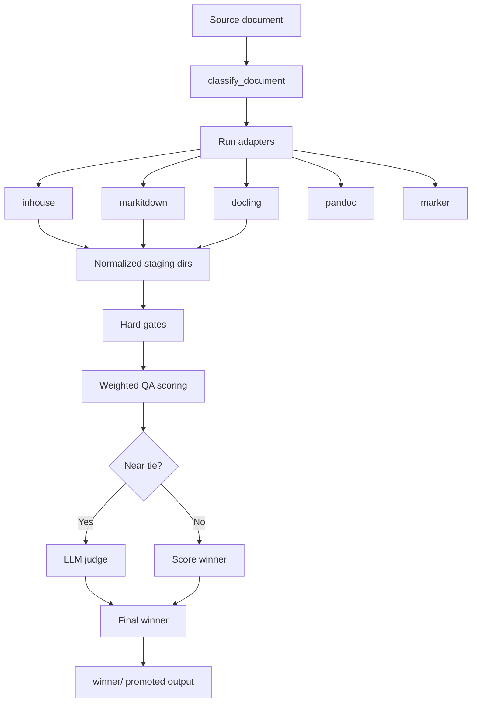

# any-doc-to-md

`anydoc2md` is a shared Python package for:

- document-to-Markdown conversion
- structural and fidelity QA over conversion outputs
- multi-adapter converter tournaments
- near-tie LLM judging between competing Markdown outputs

Source lives under `src/anydoc2md/`.

## How It Works

At a high level, `anydoc2md` classifies a source document, runs one or more
converter methods, applies hard quality gates, scores the surviving outputs,
and optionally asks an LLM judge to break near-ties. When the host project
provides a project-local `.any-doc-to-md/` directory, tournament findings can
also be persisted there for LLM-only review loops or for coding-agent follow-up
via in-house override files.



Standard staging layout for each method:

- `index.md`
- `images/`
- `result.json`

That normalized layout is what lets the tournament compare different
converters uniformly.

## Scope

This package owns reusable conversion and judging logic.

This package does not own:

- application-specific `.env` loading
- process exit behavior
- project-specific orchestration outside the shared conversion/judge surfaces

Host applications are expected to provide runtime configuration through environment variables or explicit `JudgeSettings`.

## Converter Methods

Current tournament adapters:

- `inhouse`
- `markitdown`
- `docling`
- `pandoc`
- `marker`

External tools used:

| Adapter | External package / tool | Interface used | Typical input support |
|---|---|---|---|
| `inhouse` | none beyond Python libraries used internally | direct Python call | PDF, DOCX, HTML, TXT |
| `markitdown` | `markitdown` CLI | subprocess | PDF, DOCX, PPTX, XLSX, HTML, TXT, EPUB, ZIP |
| `docling` | `docling` CLI | subprocess | PDF, DOCX, PPTX, XLSX, HTML, Markdown, AsciiDoc, TXT |
| `pandoc` | `pandoc` CLI | subprocess | HTML, DOCX, Markdown, TXT, RST, AsciiDoc |
| `marker` | `marker_single` CLI | subprocess | PDF |

### In-house vs External Adapters

The in-house adapter is not just a fallback. It is a first-class tournament
candidate that uses the package's own converter modules directly.

| Dimension | `inhouse` | `markitdown` | `docling` |
|---|---|---|---|
| Execution model | direct Python modules | external CLI via subprocess | external CLI via subprocess |
| Normal output shape | already aimed at package staging layout | flat Markdown file, adapter normalizes to `index.md` | `<stem>.md` plus artifacts dir, adapter normalizes to `index.md` + `images/` |
| Image handling | package-native handling, then image dimensions annotated | often little or no extracted image output for PDFs | exports referenced image files and adapter rewrites them into `images/` |
| Dependency surface | only the package + Python libs | requires installed `markitdown` CLI | requires installed `docling` CLI |
| Failure mode | Python exception path becomes structured adapter error | subprocess exit code / timeout / missing CLI | subprocess exit code / timeout / missing CLI |
| Main strength | tight integration and predictable staging semantics | broad document support and simple CLI contract | strong document-structure and image-export behavior |

### What "In-house" Means

`inhouse` wraps the package's own converter stack:

- `format_converters/pdf_converter.py`
- `format_converters/docx_converter.py`
- `format_converters/html_converter.py`
- `format_converters/txt_converter.py`

It differs from the external adapters in two important ways:

1. It does not shell out to an external converter binary.
2. It uses the package's own conversion logic directly, so layout decisions,
   normalization behavior, and staging semantics stay under package control.

The external adapters are useful as competing opinions in the tournament.
The in-house path is useful as the package-controlled baseline.

`pandoc` and `marker` are implemented as opt-in adapters. They are available in
the runtime registry, but they are not part of `DEFAULT_ADAPTERS`, so host
projects can enable them selectively based on packaging and license posture.

## Project-local ADTM state

Host projects can optionally keep project-specific tournament state under a
local `.any-doc-to-md/` directory.

Supported patterns today:

- `llm-findings/<doc-key>.json` for persisted judge findings and remediation
  plans generated from tournament runs
- `inhouse-overrides/<doc-key>.override.yaml` for coding-agent-authored
  in-house conversion overrides that get staged into `document.override.yaml`
  before the in-house converter runs

This keeps parent-project-specific ADTM learnings out of package source while
still making them easy to review or share.

## Judge Configuration

The near-tie judge is configured via `anydoc2md.settings`.

Required environment variables:

- `ANYDOC2MD_JUDGE_URL`
- `ANYDOC2MD_JUDGE_MODEL`

Optional environment variables:

- `ANYDOC2MD_JUDGE_TIMEOUT_S`
- `ANYDOC2MD_JUDGE_MAX_TOKENS`
- `ANYDOC2MD_JUDGE_DISABLE_THINKING`
- `ANYDOC2MD_JUDGE_TEMPERATURE`

If required values are missing, the library raises `AnyDocToMdConfigError` when loading settings explicitly, or returns an error verdict when `judge_near_tie()` attempts to load them implicitly.

## Example

```python
from anydoc2md.llm_judge import judge_near_tie
from anydoc2md.settings import JudgeSettings

settings = JudgeSettings(
    url="http://127.0.0.1:1234/v1",
    model="qwen/qwen3.6-35b-a3b",
)

verdict = judge_near_tie(candidates, source_path, traits, settings=settings)
```

## Development

The package is a normal `src/` layout project:

```bash
cd packages/any-doc-to-md
python -m pip install -e .
```

Host applications can either install the package normally or put `src/` on `PYTHONPATH` during development.

Run the package test suite directly:

```bash
cd packages/any-doc-to-md
PYTHONPATH=src pytest -q tests
```
